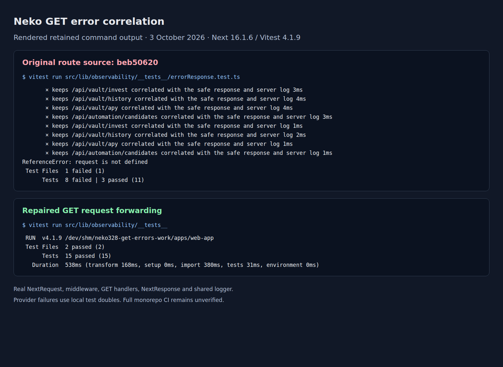

# GET error correlation evidence

The image below is a rendering of retained command output, not an original terminal screenshot or session recording. The unabridged logs from the same runs are retained alongside it.

- [Original route source run](get-error-correlation-baseline-regression.log): all eight new handler cases fail, exposing the undefined request in the invest handler and the discarded request IDs in the other three handlers. The three existing helper cases pass.
- [Repaired source run](get-error-correlation-candidate-regression.log): all 15 observability cases pass across two files.

The original routes are from `beb50620e25bddac12e5c64e9a3fc7b632764439`; the repaired source is commit `8ef587664f327298c7ace5d5741333ae4ed905da`.

The original comparison ran `vitest run src/lib/observability/__tests__/errorResponse.test.ts`; the repaired run used `vitest run src/lib/observability/__tests__`, from the web application workspace. The runtime used Next.js 16.1.6 and Vitest 4.1.9.

These cases execute the real NextRequest, middleware header forwarding, GET handlers, NextResponse, and shared logger. Local test doubles supply controlled provider failures; no live service or blockchain calls occur. Both client-supplied and middleware-generated request IDs are checked across the middleware, response header/body, and server log. Detailed errors remain in server logs, while the client receives the shared safe error message.

Changed-file ESLint passed for all six TypeScript files. Full dependency installation failed with ENOSPC, so this bounded runtime cannot establish a complete monorepo CI or production-build result. The project typecheck proceeds past the repaired coordinator import parse error but stops on missing dependencies/types. Full CI and the production build remain outstanding in a complete dependency environment. The timings in the logs are local test-run durations, not a service latency benchmark.
